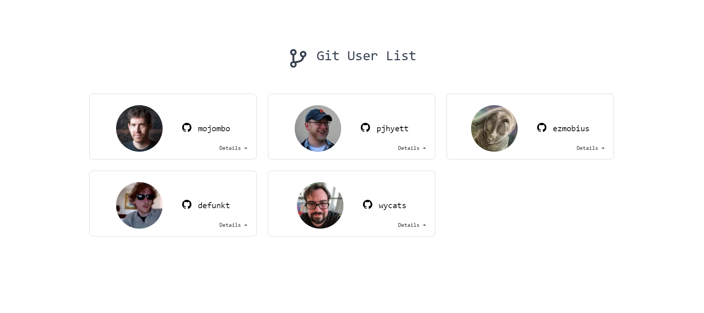
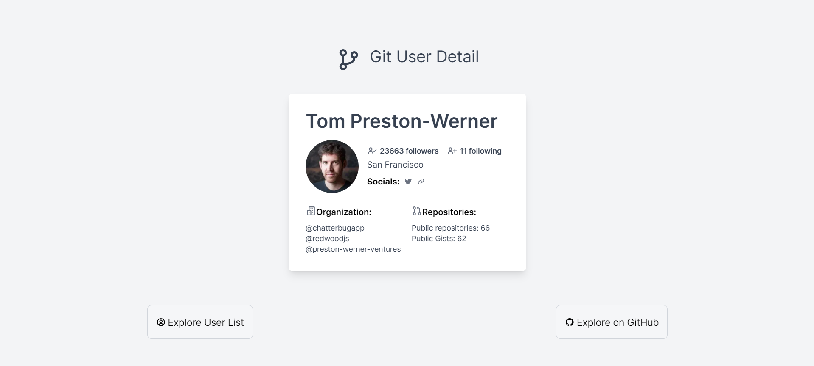
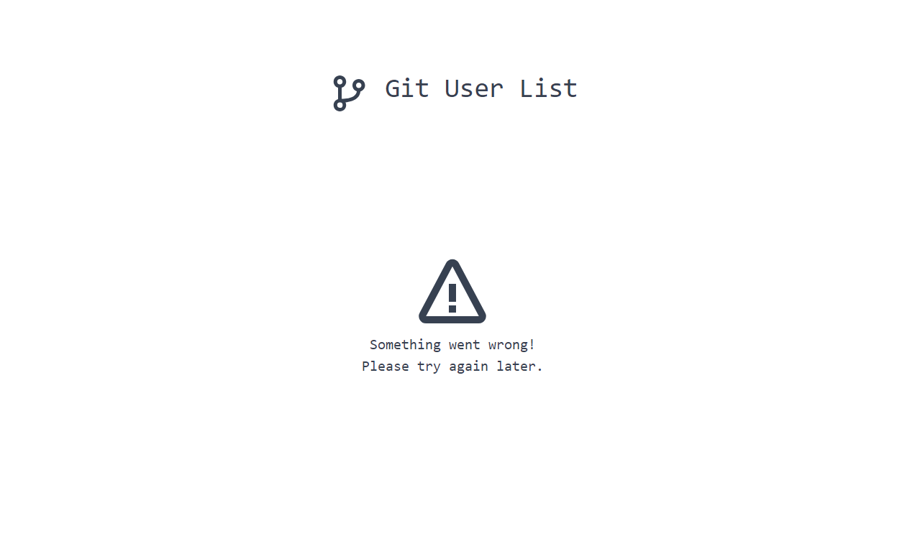

# CloudBees - Public GitHub Users Website

This project is bootstrapped with [Next.JS](https://nextjs.org/) and designed using [Tailwind CSS](https://tailwindcss.com/) with [react-icons](https://react-icons.github.io/react-icons) for icons.

## Project Setup

### Pre-requisites

- Node.js

### Setup

- Clone the [repository](https://github.com/AnushaDeviR/) (branch: main) for the updated code or unzip the file and open it with your favorite IDE.
- Run `npm install` to install all the required packages for the front-end application to run.
- Run `npm run dev` to locally run the application at [localhost:3000](http://localhost:3000)

## API Blueprint

The following project contains two external API endpoints from GitHub to display the users list on the homepage and their GitHub details on the user detail page, below are the following APIs:

1. To display all users on a list - [/users](https://api.github.com/users)
2. To view each users details from GitHub - [/users/${username}](`https://api.github.com/users/${username}`)

## Functionalities

The website displays GitHub user list that are publicly available on [GitHub API](https://docs.github.com/en/rest?apiVersion=2022-11-28) and their user details and is developed to be responsive on various screen sizes.



- The following application allows users to view more details about the GitHub user by clicking on the user cards.



- The user detail page contains of more information about the user such as their name, a summary of their followers, social handles, organizations and public repository and gists.

- By clicking on the `Explore User List` button, the user list page (i.e. the homepage) will be rendered.

- By clicking on the `Explore on GitHub` button, their GitHub page can be viewed.

- Supports error page and loading page.



### Supported screen sizes (breakpoints):

- `@media (min-width: 640px)`
- `@media (min-width: 768px)`
- `@media (min-width: 1024px)`

### Limitations:

- The current version displays only 5 users on the user list (homepage) due to rate-limits incorporated on the publicly available API, this is handled using pagination and can be edited on the file `filename`.

```js
const userDataResponse = await fetch("https://api.github.com/users?per_page=5");
```

- To handle viewing of the name from another API which can be fetched with the username available on the `/users` API, `useContext()`

### Future works

- Add dark and light mode themes.
- Create a share button to send a shortened URL of the user detail page.
- Handle additional APIs to view personal information on the user list card.
